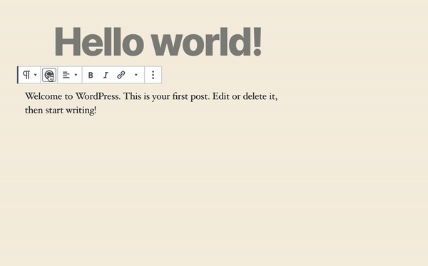

To enable previews you either need a running instance of `gatsby develop` with ENABLE_GATSBY_REFRESH_ENDPOINT env variable enabled or a Preview instance running in `Gatsby Cloud`.

> Check out the [official docs](https://www.gatsbyjs.org/docs/running-a-gatsby-preview-server/) on how tu run your preview instance

## Wordpress

To be able to see previews in gutenberg, you need to install a plugin into Wordpress.

### wp-gatsby-gutenberg

- Install the plugin manually, by downloading it from [here](https://github.com/GatsbyWPGutenberg/wp-gatsby-gutenberg/releases).
- Install with [composer](https://packagist.org/packages/gatsby-wordpress-gutenberg/wp-gatsby-gutenberg)

```sh
composer require gatsby-wordpress-gutenberg/wp-gatsby-gutenberg
```

## Setup

The enable live previews in Gutenberg, follow these steps:

- enable your preview instance through `Settings -> GatsbyJS`
- enable previews in gutenberg in `Settings -> GatsbyJS Gutenberg`

> You should see preview icon inside block's edit toolbar.



> Each time a block content is changed and the preview button is clicked, a new Gatsby Preview trigger is send. This means this will also count to your previews count when running on Gatsby Cloud.

## How does it work

- `wp-graphql-gutenberg` saves the live changes in gutenberg in the database within custom post type, which has one to one relationship with the edited post
- when clicking the block preview button (available when the option is enabled), the preview content is sourced by `gatsby-source-wordpress-experimental` and special preview page for that post type is created within `gatsby-theme-wordpress-gutenberg`
- the page with the highlighted block is then displayed inside gutenberg within an iframe
