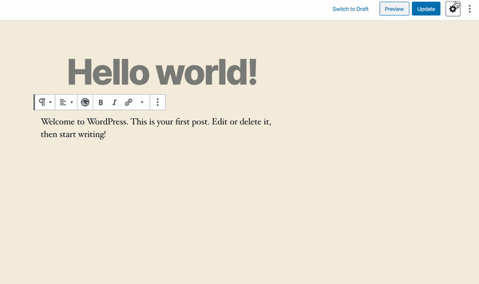

To enable previews you either need a running instance of `gatsby develop` or a Preview instance running in `Gatsby Cloud`.

## Overview

The preview lifecycle is roughly explained in these steps:

- you define your preview instance url in `wp-config.php`
- `wp-gatsby-gutenberg` creates its own custom wp post type `wgg_preview`, which is exposed through rest api and used when you type new content in the gutenberg editor
- the changes are batched and saved in the database within custom post type above, which has one to one relationship with the edited post
- `gatsby-source-wordpress` then sources these posts as well and the `gatsby-source-gutenberg` resolves the matching.
- to fetch preview url and let gatsby know that it is out of sync with the newest content, the gatsby instance exposes POST `/___gutenberg/previews/:id` endpoint where wordpress server sends small notification payload upon each change in gutenberg

> The autogenerated preview pages use `/___gutenberg/previews/:id` url path

## Setup

To enable previews, you need to define `WP_GATSBY_GUTENBERG_PREVIEW_URL` in your WordPress instance with your gatsby develop instance url.

wp-config.php:

```php
define('WP_GATSBY_GUTENBERG_PREVIEW_URL', 'http://localhost:8000');
```

> If you are not sure how to setup your local development, we recommend to use [Local by Flywheel](https://localwp.com), where you can run your WordPress instance on the same machine as Gatsby easily.

For production or Gatsby Cloud instances we also recommend to define `WP_GATSBY_GUTENBERG_PREVIEW_TOKEN` constant, which is sent as `X-Gatsby-Wordpress-Gutenberg-Preview-Token` request header. If the token mismatches with Gatsby's configured one, the requests are rejected with 401 status.

wp-config.php:

```php
define('WP_GATSBY_GUTENBERG_PREVIEW_URL', 'm7_s3cr3t_token');
```

gatsby-config.js:

```js
module.exports = {
  plugins: [
    // ...other plugins
    {
      resolve: `gatsby-theme-wordpress-gutenberg`,
      options: {
        // ...other options
        previewToken: `m7_s3cr3t_token`,
      },
    },
```

## Block Previews

If enabled, you should see preview icon inside block's edit toolbar.


## Page Previews

If enabled, you should see preview button inside settings toolbar in document section.


