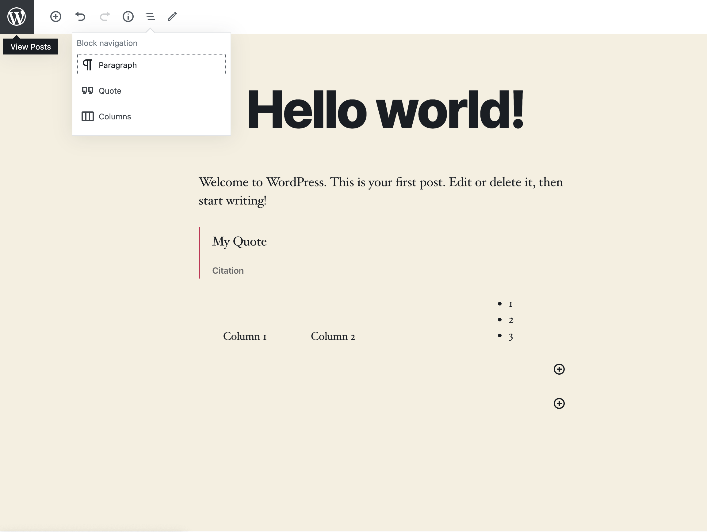
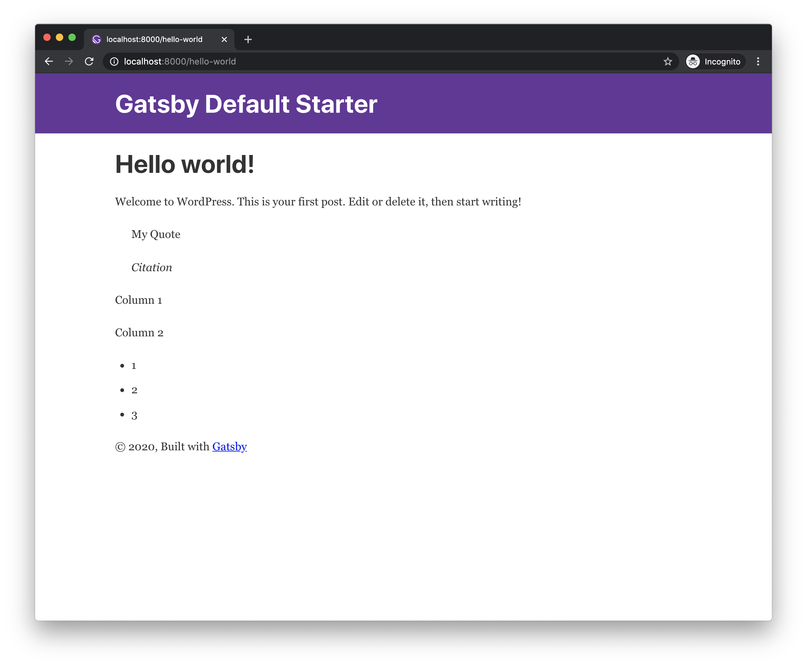
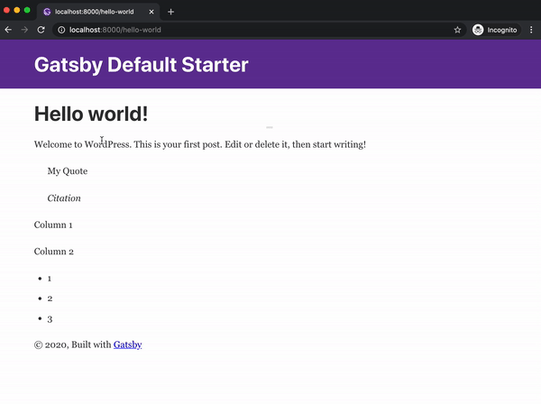
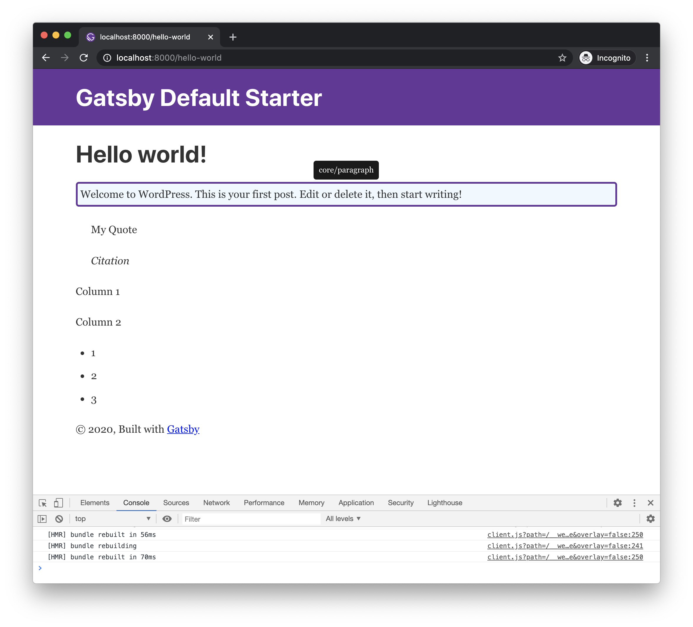
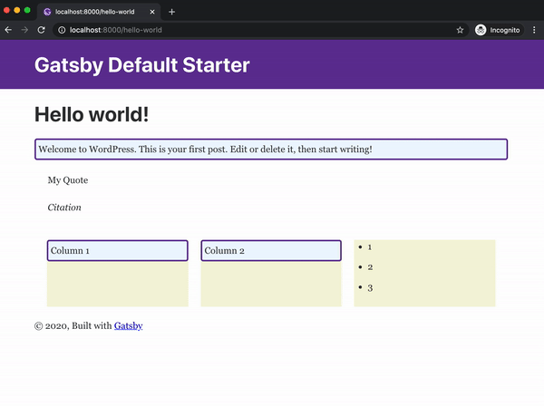

## Install all dependencies

This tutorial works with following versions of the plugins:

- wp-graphql 0.9.1
- wp-gatsby 0.4.1
- wp-graphql-gutenberg 0.3.4
- gatsby-source-wordpress-experimental 0.7.13

## Create a site

> This tutorial follows up the the official create a site from strach tutorial from `gatsby-source-wordpress-experimental`.

Follow the offical [site from stratch](https://github.com/gatsbyjs/gatsby-source-wordpress-experimental/blob/master/docs/tutorials/building-a-new-site-wordpress-and-gatsby.md) tutorial. When your site is up and running go to the next section.

## Add testing content

Add new blocks to the default **Hello World** post. In this example, we added `Quote` and `Columns` blocks with some random content.



## Query Blocks component

Open your `src/templates/blog-post.js`. Instead of `content`, we will now query for `Blocks` field. The Blocks field returns a React component which you can use when rendering your BlogPost component.

> During fast refreshing of new content, there can be situations when the Blocks component can resolve to null, so you need to also make checks for this situation in your code.

The `Blocks` component is a component which represents your structured content and is created during build phase. The post content is analyzed for all the blocks it contains and then the components which currently represent each block are consolidated into one component. This way, you only provide your custom implementations for each block and the magic of querying and sticking up the content together is done for you behind the scenes.

```js
import React from "react"
import Layout from "../components/layout"
import { graphql } from "gatsby"

export default function BlogPost({ data }) {
  const post = data.allWpPost.nodes[0]
  console.log(post)
  return (
    <Layout>
      <div>
        <h1>{post.title}</h1>
        {/* Changed rendering of content to post.Blocks */}
        {post.Blocks && <post.Blocks />}
      </div>
    </Layout>
  )
}
export const query = graphql`
  query($slug: String!) {
    allWpPost(filter: { slug: { eq: $slug } }) {
      nodes {
        title
        Blocks ### changed content to Blocks
      }
    }
  }
```



Not much has changed visually, however now we are now not rendering the content as a raw html, but rather as a list of child components.

> You may encounter a bug when nothing is rendered when you change the fields in the query for the first time. Until this is resolved, simply stop the develop command, run `gatsby clean` and start the `gatsby develop` again.

## Add your first block implementation

You can write your own custom block implementation for each block. Otherwise the default `<UnknownBlock />` implementation is used which just displays the raw html output of the block.

We will start with shadowing this special component so we can display tooltip with the block name when hovering mouse over each block.

> The example uses `rmwc` library which is a fantastic React Material Design implementation. Make sure to install it using npm/yarn.

Create a file with path `src/gatsby-theme-wordpress-gutenberg/components/unknown-block.js`, with following content:

```js
import React from "react"
import { graphql } from "gatsby"

import Block from "../../components/block"

export const query = graphql`
  fragment UnknownBlock on WpBlock {
    ...Block
    saveContent
  }
`

export default function UnknownBlock(props) {
  const { saveContent } = props

  return (
    <Block {...props}>
      <div dangerouslySetInnerHTML={{ __html: saveContent }} />
    </Block>
  )
}
```

> The file should contain a graphql fragment definition on the block's graphql type, where you can query for block fields, this fragment will be included when querying for `Blocks` component field. In the example we are using `WpBlock` type which is common interface type for all blocks.

As you can see in the file above, we also need to create a file in `src/components/block.js`, with following content (this component will be reused later in our various block implementations):

```js
import React from "react"
import { graphql } from "gatsby"
import { Tooltip } from "@rmwc/tooltip"

import "@rmwc/tooltip/styles"

export const query = graphql`
  fragment Block on WpBlock {
    name
  }
`

export default function Block({ name, children }) {
  return <Tooltip content={name}>{children}</Tooltip>
}
```

Now you should see a tooltip when hovering each block with its name.



## Add Paragraph

Let's say we want to have a paragraph block which has an oval shape with border and some custom background color.

You can add your custom block implementations in `src/gatsby-theme-wordpress-gutenberg/components/blocks/[block-name].[ext]`.

To create a custom Paragraph block implementation create `src/gatsby-theme-wordpress-gutenberg/components/blocks/core/paragraph.js`:

```js
import React from "react"
import { graphql } from "gatsby"

import Block from "../../../../components/block"

import "@rmwc/tooltip/styles"

export const query = graphql`
  fragment Paragraph on WpCoreParagraphBlock {
    ...Block
    attributes {
      ... on WpCoreParagraphBlockAttributes {
        content
        dropCap
        customBackgroundColor
      }
    }
  }
`

export default function Paragraph(props) {
  const { attributes } = props

  return (
    <Block {...props}>
      <p
        style={{
          backgroundColor: attributes.customBackgroundColor || `aliceblue`,
          border: `3px solid rebeccapurple`,
          borderRadius: `5px`,
          padding: 5,
        }}
        dangerouslySetInnerHTML={{ __html: attributes.content }}
      />
    </Block>
  )
}
```

After a hot reload you should see the result instantly:



## Add custom layout for Columns, Column

To demonstrate how to work with the inner blocks feature, we will create custom implementations of Columns and Column blocks, which will map to rmwc's `<Grid>` and `<GridCell>`.

> The `innerBlocks` components are passed in as the `children` prop

To create a custom Columns block implementation create `src/gatsby-theme-wordpress-gutenberg/components/blocks/core/columns.js`:

```js
import React, { useMemo } from "react"
import { graphql } from "gatsby"
import { Grid } from "@rmwc/grid"

import Block from "../../../../components/block"

import "@rmwc/grid/styles"

export const query = graphql`
  fragment Columns on WpCoreColumnsBlock {
    ...Block
  }
`

export const ColumnsContext = React.createContext()

export default function Columns(props) {
  const { children, ...rest } = props

  const value = useMemo(() => {
    const element = React.Children.toArray(children).pop()

    return {
      columns: element?.props?.blocks?.length || 0,
    }
  }, [children])

  return (
    <ColumnsContext.Provider value={value}>
      <Block {...rest}>
        <Grid>{children}</Grid>
      </Block>
    </ColumnsContext.Provider>
  )
}
```

To create a custom Columns block implementation create `src/gatsby-theme-wordpress-gutenberg/components/blocks/core/column.js`:

```js
import React, { useContext } from "react"
import { graphql } from "gatsby"
import { GridCell } from "@rmwc/grid"
import { ColumnsContext } from "./columns"

import Block from "../../../../components/block"

import "@rmwc/grid/styles"

export const query = graphql`
  fragment Column on WpCoreColumnBlock {
    ...Block
  }
`

export default function Column(props) {
  const { children, ...rest } = props
  const { columns } = useContext(ColumnsContext)

  return (
    <GridCell style={{ backgroundColor: "beige" }} span={12 % columns}>
      <Block {...rest}>{children}</Block>
    </GridCell>
  )
}
```

And the result should like this:



> You can find the final result of this tutorial in the `examples/gatsby-wordpress-gutenberg-default-example/frontend` in the project's repo
